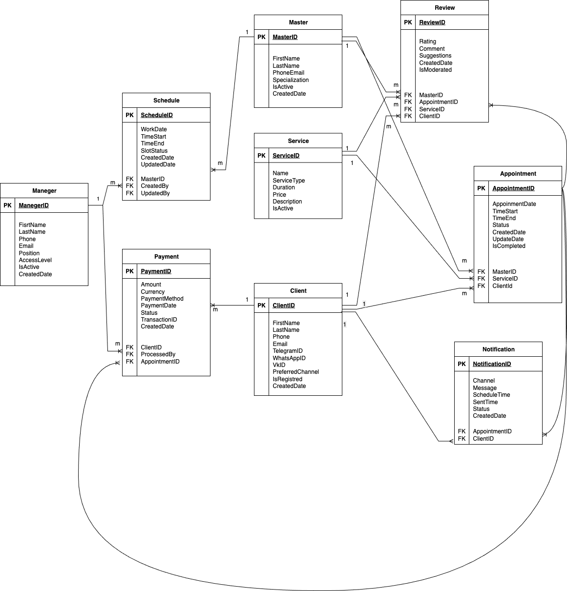

# BSA4_Domains

Проект по моделированию предметной области, выделению сущностей и построению логической модели данных для барбершопа (BRB) и службы доставки (DLV).

## 🛠 Навыки
- Domain Analysis
- Entity Detection
- CRUD Validation
- Data Dictionary
- ER-diagram (Logical Data Model)

## 📋 Описание проекта
В ходе работы я провела анализ предметной области, выделила ключевые сущности и построила логическую модель данных для двух сервисов: барбершоп (онлайн-запись) и доставка (курьерская служба).

### Что именно было сделано:
1. **Выявление сущностей (BRB)**: Определила 9 сущностей с назначением и ключевыми атрибутами (Клиент, Мастер, Услуга, Запись, Расписание, Отзыв, Платеж, Уведомление, Менеджер).
2. **Выявление сущностей (DLV)**: Определила 8 сущностей с назначением и ключевыми атрибутами (Пользователь, Курьер, Поставщик, Заказ, Назначение заказа, Платеж, Уведомление, Локация).
3. **CRUD-анализ (BRB)**: Проверила полноту операций Create/Read/Update/Delete для 9 сущностей с указанием ролей и действий.
4. **Словарь данных (BRB)**: Составила словарь для 9 сущностей с мнемоникой, описанием, типом данных и обязательностью.
5. **Словарь данных (DLV)**: Составила словарь для 8 сущностей с мнемоникой, описанием, типом данных и обязательностью.
6. **ER-диаграмма (BRB)**: Построила логическую модель данных с указанием связей между сущностями.
7. **ER-диаграмма (DLV)**: Построила логическую модель данных с указанием связей между сущностями.

## 📂 Файлы
Все рабочие материалы проекта находятся в репозитории выше:
- [BRB/](./BRB/) — аналитика по проекту барбершопа (онлайн-запись)
- [DLV/](./DLV/) — аналитика по проекту доставки (курьерская служба)

## 🔍 Пример ER-диаграммы

Ниже показана логическая модель данных для барбершопа (онлайн-запись).

